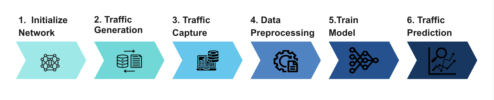

# Traffic Prediction in SDN Networks

## Overview

This project aims to analyze traffic patterns and predict traffic within Software-Defined Networking (SDN) environments. This involves capturing network traffic using either RYU or tcpdump, followed by training machine learning models to forecast traffic. The performance analysis includes running traffic flows for 30 seconds or more, with 80% of the data used for training and 20% for testing the ML algorithm. As part of the exploration, we will examine the efficacy of Prophet by Meta as a potential tool for this task. This project aims to provide insights into traffic prediction methodologies and their applicability in SDN networks.

## Objectives
•	To implement a  random topology using mininet and Ryu controller   

•	To generate the dataset

•	To capture the traffic using RYU or tcpdump

•	To apply Prophet Machine learning algorithm to predict traffic in an SDN network

•	To improve traffic prediction using a new machine learning algorithm (ARIMA)

## Implementation Flow
To achieve the goal of analyze traffic patterns and predict traffic in a SDN network, a model is build on the application plane.



The architecture of implemented method consists of a first step where the network is initialize to a procedurely generated topology. Then, we generate the traffic on the newtork and capture the packets that flow amomg the switches. Before training the model we process it and extract only the amount of data flowing in a time-step. Only 80% of the data is used to train the model the rest is used for testing.

## Getting Started
Clone the repository
```bash
git clone https://github.com/MattiaDeMunari/SDN-Traffic-Prediction
```

## Requirements
Mininet and Ryu can be installed following the instructions on this [website](https://www.granelli-lab.org/researches/relevant-projects/comnetsemu-labs). The application require Python 3.

Install Python3 dependencies using pip:
```bash
sudo pip3 install -r requirements.txt
```
## Usage
### Topology and traffic generation
This repository contains the following structure: 

SDN-Traffic-Prediction
```
├── utils
├── training_data (_auto-generated_) : saved arima training data
├── plots (_auto-generated_) : saved images prediction plots
├── captures (_auto-generated_) : saved traffic data captures
├── main.py
├── traffic_prediction.py
```

Build and start the topology with Mininet and generate traffic.
```bash
sudo python3 main.py [--switches SWITCHES] [--hosts HOSTS] [--cross-connection CROSS_CONNECTION] [--time TIME]
```

The script allows users to define custom network topologies by specifying the number of switches, hosts per switch, and interconnectivity between switches. These parameters can be adjusted according to the desired testing scenario.

N.B.: Mininet requires this script to be ran as root, therefore sudo is mandatory

Arguments:
- `--switches`: Number of switches in the network. Default is 7.
- `--hosts`: Number of hosts per switch. Default is 2.
- `--cross-connection`: Interconnectivity ratio between switches. Default is 0.30.
- `--time`: Duration of the test in seconds. Default is 30.

Example of command that will run the script with 10 switches, 3 hosts per switch, 50% cross-connection, and a test duration of 60 seconds.
```bash
sudo python3 main.py --switches 10 --hosts 3 --cross-connection 0.50 --time 60

```
Application flow:
1. Network creation: building of the specified network topology using Mininet.
2. STP configuration: waiting for Spanning Tree Protocol (STP) configuration to avoid network loops.
3. Ping connectivity test: ping connectivity test between all hosts in the network to verify basic network connectivity.
4. Traffic generation: starting servers on some hosts and clients on others. 
5. Traffic capture: capture of network traffic passing through the switches using TCPdump for analysis.

### Traffic prediction
The script created in order to predict network traffic patterns accepts various command-line arguments for flexibility in data input and output customization.

Start traffic prediction process:  
```bash
python3 traffic_prediction.py [--csv CSV] [--store-plot STORE_PLOT] [--training-split TRAINING_SPLIT] [--sample-period SAMPLE_PERIOD]
```

Arguments:
- `--csv`: Path to the folder containing the training data, the fodler should contain a folder for each swich, which in turn contains a *.csv* file for each interface.
- `--store-plot`: Path to the folder where the plots will be stored. Default is "plots".
- `--training-split`: Percentage of data used for training. Default is 80%.
- `--sample-period`: Period over which to combine network data in pandas date-time format. Default is "0.2S"

To run the script with custom parameters:
```bash
python3 traffic_prediction.py --csv captures --store-plot my_plots --training-split 0.75 --sample-period "0.1S"
```
